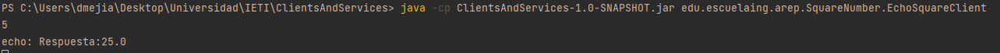
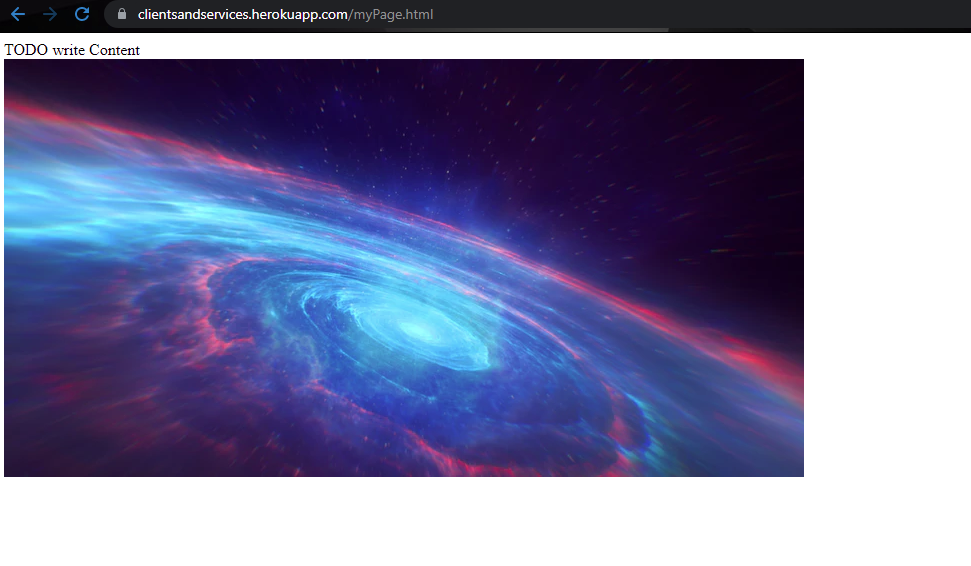
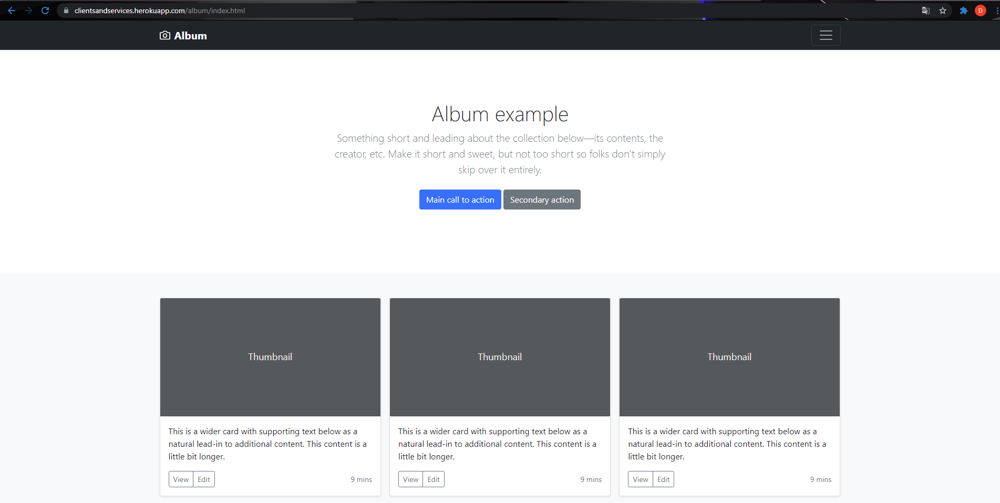

# ClientsAndService
Taller en donde se realizan distintos ejercicios de networking como manejo de sockets, servidor web HTTP.
## Instrucciones de Uso
### Prerrequisitos
* git version 2.25.1
* Apache Maven versión: 4.0.0
* java versión: "1.8.0"
### Ejecución
Para poder usar el proyecto lo primero que se debe realizar es clonar el proyecto utilizando el siguiente comando desde una terminal:
```
git clone https://github.com/Desarik98/NetworkClientService.git
```
Luego debe redirigirse por medio de la terminal al directorio en donde se clonó el proyecto la cual contendrá el archivo pom.xml.
Una vez ubicado en este directorio se debe compilar el programa, para esto, utilice el siguiente comando:
```
mvn package
```
#### Ejercicio 1: URLScanner
Utilice el siguiente comando para la ejecución del ejercicio:
```
java -cp java -cp ClientsAndServices-1.0-SNAPSHOT.jar edu.escuelaing.arsw.URLReaderScanner.URLScanner http://ldbn.escuelaing.edu.co:80/publicaciones.pdf=val=45&r=78#publicaciones
```
Donde se mostrará el siguiente resultado:
```
Protocolo: http
authority: ldbn.escuelaing.edu.co:80
host: ldbn.escuelaing.edu.co
port: 80
path: /publicaciones.pdf=val=45&r=78
quey: null
file: /publicaciones.pdf=val=45&r=78
ref: publicaciones
```
Este ejercicio nos retorna toda la información de un objeto URL. En este caso, de la URL http://ldbn.escuelaing.edu.co:80/publicaciones.pdf=val=45&r=78#publicaciones
#### Ejercicio 2: URLReader
Esta aplicación pregunta a una dirección URL al usuario, lee y almacena los datos de esta URL en un documento HTML, el formato de la URL debe incluir el protocolo.

Utilice el siguiente comando para la ejecución del ejercicio:
```
java -cp java -cp ClientsAndServices-1.0-SNAPSHOT.jar edu.escuelaing.arep.URLReaderScanner.URLReader URL
```
Ejemplo del comando para la ejecución del ejercicio
```
java -cp java -cp ClientsAndServices-1.0-SNAPSHOT.jar edu.escuelaing.arep.URLReaderScanner.URLReader https://www.google.com
```

#### Ejercicio 3: SquareNumber
Esta aplicación nos retornará el cuadrado de un número dado por el Cliente, para esto se hace el uso de sockets, que se utilizan para realizar la comunicación con el Servidor quien devolverá el cuadrado de este número.

Utilice los siguientes comandos en diferentes terminales para la ejecución del ejercicio:
(Primero el Servidor, luego el Cliente)
```
java -cp ClientsAndServices-1.0-SNAPSHOT.jar edu.escuelaing.arep.SquareNumber.EchoSquareServer
java -cp ClientsAndServices-1.0-SNAPSHOT.jar edu.escuelaing.arep.SquareNumber.EchoSquareClient
```
A continuación en la terminal en donde se ejecuta el Cliente, digitará cualquier número, y al darle Enter le devolverá un mensaje con el cuadrado correspondiente.



#### Challenge: HTTPServer
Implementación de un servidor web que soporta solicitudes no concurrentes el cual retorna todos los archivos solicitados, incluyendo páginas HTML e imágenes.

Utilice el siguiente comando para ejecutar el servidor web:
```
java -cp ClientsAndServices-1.0-SNAPSHOT.jar edu.escuelaing.arsw.HttpServer.HttpServer
```
A continuación diríjase a un browser y digite las siguientes URL
```
http://localhost:35000/myPage.html
http://localhost:35000/album/index.html
```
La primera URL mostrará una página web básica en donde se verá el retorno de imágenes.



La segunda URL mostrará una página web con Bootstrap en donde se verá el retorno de html, js y css.



El servidor esta montado en la nube de Heroku con la siguiente URL: https://clientsandservices.herokuapp.com/

Puede dirigirse a las siguientes URL para confirmar su funcionalidad

http://clientsandservices.herokuapp.com/myPage.html

http://clientsandservices.herokuapp.com/album/index.html


## Autor
* Daniel Alejandro Mejía Rojas - Fecha: 04/09/2021
## Licencia
This project is licensed under the MIT License - see the LICENSE.md file for details
